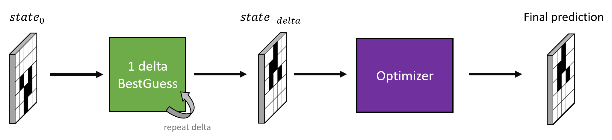
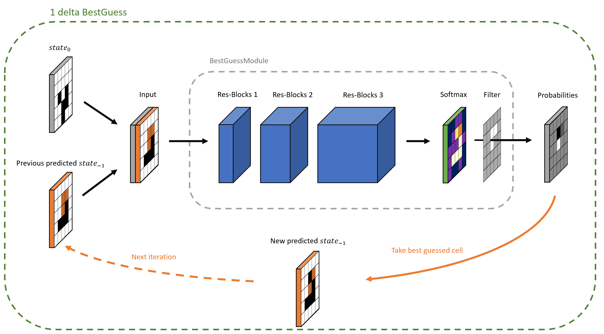

# Kaggle: 3rd place solution of Conway's Reverse Game of Life 2020 (part)

I competed together with Kota Iizuka.
This repository only contains the code of my approach.

## Approach

Given a game of life `end state`, the task is to find a valid `start state`, which evolves to the desired `end state` after `delta` steps. 

The approach has two main components:

- BestGuess, a neural network which predicts the start state for a single step. It is repeated for `delta` greater than 1.
- Followed by an Optimizer

### BestGuess

The neural network only predicts one cell at a time, as there are many possible `start state` which lead to the same `end state`. Inspired by language models, it gets the already predicted cells as input to create an in itself consistent result.

### Optimizer
The optimizer picks a random 3x3 region in the predicted start state, tries every possible combination of the 3x3 cells at once and selects randomly between the ones which produce the best score. It is entirely implemented on the GPU.

## Notebook
An animation of the approach solving a state can be seen in the [notebook](https://www.kaggle.com/markuskarmann/3rd-place-solution-part) on kaggle.
